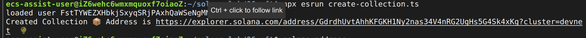
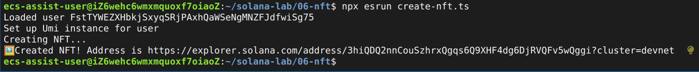
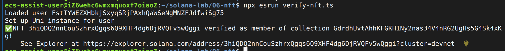

# NFT lab

## create nft collection

```shell
npx esrun create-collection.ts
```

make sure you set the keypair before `solana config set --keypair file.json`



## create nft

```shell
# remember to update nft-collection address 
npx esrun create-nft.ts
```



## verify the NFT 

```shell
# remember to update the nft address first
npx esrun verify-nft.ts
```

